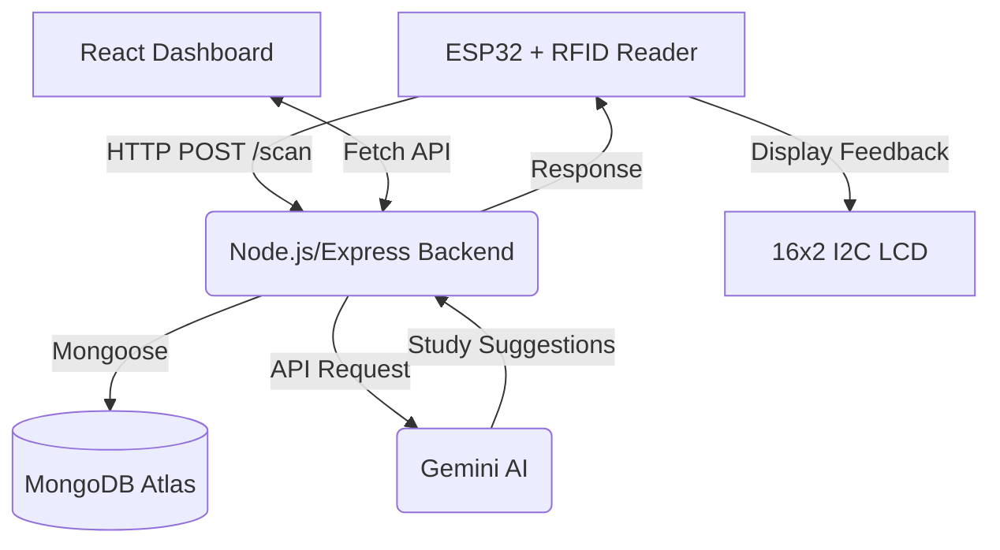

# 📚 Smart Library Attendance System with AI Analytics

[](https://www.espressif.com/en/products/socs/esp32)
[](https://nodejs.org/)
[](https://deepmind.google/technologies/gemini/)
[](https://www.mongodb.com/cloud/atlas)

A complete IoT-based solution for tracking student library attendance using RFID technology, featuring a real-time React dashboard and AI-powered study pattern suggestions.

---

## 🌟 Key Features

### 📡 IoT Core (Hardware)
- **RFID Scan**: Instant student entry/exit tracking using MFRC522 and RFID cards.
- **I2C LCD Display**: Real-time feedback for students, including AI suggestions with auto-scrolling logic.
- **Wi-Fi Connectivity**: Seamless data transmission from ESP32 to the cloud backend.

### 🤖 AI Study Coach
- **Smart Analysis**: Integrates **Google Gemini 2.0 Flash** to analyze attendance patterns.
- **Personalized Suggestions**: Provides students with positive, actionable feedback (e.g., "Morning Bird," "Weekend Warrior") directly on the hardware display.
- **Heuristic Fallback**: Includes a robust local fallback system to ensure continuous functionality even without internet/API access.

### 📊 Admin Dashboard
- **Live Monitoring**: Real-time view of students currently inside the library.
- **Student Management**: Full CRUD operations for managing student records.
- **History & Reports**: Detailed attendance logs with search and date-based filtering.
- **Manual Overrides**: "Force Out" capabilities for administrators.

---

## 🏗️ System Architecture



---

## 🛠️ Tech Stack

- **Frontend**: React.js, Vanilla CSS, Lucide Icons
- **Backend**: Node.js, Express.js, Mongoose
- **Database**: MongoDB Atlas (Cloud)
- **AI**: Groq AI (Gemini SDK)
- **Hardware**: ESP32, RC522 RFID Module, 16x2 I2C LCD
- **Language**: JavaScript (ES6+), C++ (Arduino IDE)

---

## 🚀 Getting Started

### 1. Prerequisites
- [Node.js](https://nodejs.org/) (LTS)
- [Arduino IDE](https://www.arduino.cc/en/software)
- MongoDB Atlas Account
- Groq API key

### 2. Backend Setup
1. Navigate to `/Library-manager-backend`.
2. Install dependencies: `npm install`.
3. Create a `.env` file:
   ```env
   PORT=5000
   MONGO_URI=your_mongodb_uri
   GROQ_API_KEY=your_api_key
   ```
4. Start the server: `npm start`.

### 3. Frontend Setup
1. Navigate to `/Library-manager-frontend`.
2. Install dependencies: `npm install`.
3. Start the dashboard: `npm start`.

### 4. Hardware Configuration
1. Open `final_esp32_lcd_cardId.ino` in Arduino IDE.
2. Update `ssid` and `password` with your Wi-Fi credentials.
3. Update `serverUrl` with your backend endpoint.
4. Upload to your ESP32.

---

## 📂 Project Structure

```text
├── Library-manager-backend/    # Express Server & AI Routes
├── Library-manager-frontend/   # React Dashboard
├── final_esp32_lcd_cardId_code/# ESP32 Firmware
├── CIRCUIT DIAGRAM.jpg         # Hardware wiring guide
└── README.md                   # This documentation
```

---

## 📝 License

Distributed under the MIT License. See `LICENSE` for more information.

---

**Developed with ❤️ by Ramesh Mangali**
